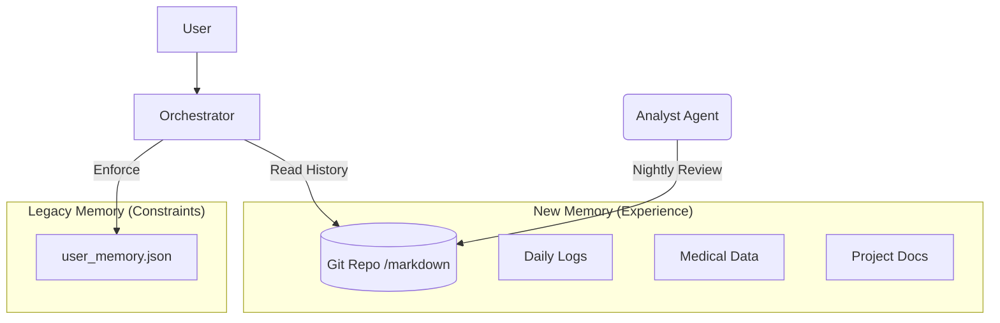

> **⚠️ Superseded — historical record (pre-4.0.0).** This documents the original JSON-rule-store vs. "Digital Personal Trainer" file-system comparison from the Gemini 3 Flash / LangChain era. The "files-as-memory" / full-context-loading side of this comparison is the argument that won — it became the cloud-native journal architecture in 4.0.0 (and the three-tier knowledge model in 4.1.0). The "OptiMind (Current)" column, the `user_memory.json` store, Gemini 3 Flash, and the Orchestrator/router framing no longer exist. Retained for decision-history context (the "why files, not just a rule store" rationale); do not treat as current. For current architecture see `docs/USER_FLOW_PLAN.md`, `README.md`, and `CHANGELOG.md` [4.0.0]/[4.1.0].

# Architecture Analysis: OptiMind vs. The "Digital Personal Trainer"

## 1. Executive Summary
The **Reference Architecture ("Digital Personal Trainer")** prioritizes **longitudinal data integrity** and **cross-domain correlation** by leveraging a file-system-as-memory approach. It treats the LLM as a processor of massive, structured history.

**OptiMind (Current)** prioritizes **explicit preference adherence** and **modularity** via a rule-based JSON store. It treats the LLM as a router and policy enforcer.

**Key Insight**: OptiMind is currently optimized for *behavioral rules* (e.g., "Don't schedule before 9 AM"), whereas the Reference Model is optimized for *data-driven insights* (e.g., "Your volume spiked, so you got sick"). To reach true "Personal Assistant" status, OptiMind must hybridize these approaches.

---

## 2. Side-by-Side Comparison

| Feature | OptiMind (Current) | Reference Model (Target) |
| :--- | :--- | :--- |
| **Memory Structure** | **JSON Rule Store** (`user_memory.json`). Stores explicit "Rules" (e.g., "I am vegan"). | **Git File System**. Stores chronological "Logs" (e.g., `2024-01-17-workout.md`). |
| **Context Strategy** | **Filtered/RAG-lite**. We inject only relevant topic rules to save context. | **Full Context Loading**. Loads entire relevant history files, relying on large context windows. |
| **Reasoning Flow** | **Reactive**. User asks -> Orchestrator routes -> Expert answers based on rules. | **Loop-Based**. Plan -> Execute -> Record -> Analyze trends over time. |
| **Data Durability** | **Medium**. JSON is fragile if not managed. Hard to read manually. | **High**. Markdown/Git is human-readable, version-controlled, and infinite. |
| **Strength** | Fast, strictly adheres to user constraints, modular. | Deep insight generation, tracks progression/trends over months. |
| **Weakness** | "Amnesia" regarding past events/logs. Cannot see trends. | Slower (reading huge files), relies on massive context window. |

---

## 3. Deep Dive: The "Context Window" Paradigm Shift

### How OptiMind does it (The "Old" Way):
We treated context as a scarce resource. We built `delete_rule` and `get_context_str(topic="scheduling")` to minimize what we send to the LLM.
*   *Result:* The bot knows *how* you like to work, but doesn't know *what* you did last week.

### How the Reference Model does it (The "Gemini 3/Claude" Way):
It treats context as abundant. It feeds the LLM *everything* (logs, blood work, diary).
*   *Result:* The LLM can spot patterns humans miss.
    *   *Example:* "You felt 'groggy' (Diary) on days you ate 'pasta' (Diet Log) and trained 'Legs' (Workout Log)."

**Lesson**: With Gemini 3 Flash (1M+ token context), OptiMind's strict filtering is becoming an anti-pattern. We should "flood" the context with structured logs.

---

## 4. Lessons for OptiMind

### Lesson 1: Memory Needs "Logs", Not Just "Rules"
We store "I like mornings" (Rule). We *don't* store "I woke up at 5:00 AM today and felt great" (Log). Without logs, we cannot perform the **Cross-Domain Correlation Analysis** (e.g., "You sleep better when you write code at night").

### Lesson 2: Git is a Superior Memory Backend
JSON is hard to maintain manually. A folder of Markdown files (`/memory/logs/YYYY-MM-DD.md`) is:
1.  **Editable** by you (using VS Code).
2.  **Versioned** (Team/Backup).
3.  **Parsable** by LLMs natively.

### Lesson 3: The "Feedback Loop" is Missing
OptimAll waits for input. The Reference Model has a "Review" phase where it analyzes the session against a 3-month trend. OptiMind needs a background process (or "Nightly Review" mode) to digest daily interactions and update the long-term strategy.

---

## 5. Strategic Recommendations

To evolve OptiMind, we should **pivot** our architecture in Phase 2:

1.  **Adopt "Hybrid Memory"**:
    *   Keep **JSON** for strict Rules (Constraints).
    *   Add **Markdown Files** for Logs (Events/Data).
    *   *Action:* Create `src/memory/journal/` repository where the bot writes daily logs.

2.  **Leverage Gemini 3's Context**:
    *   Stop filtering context so aggressively.
    *   Inject the last 7-30 days of "Journal Logs" into the Orchestrator/Experts. This enables the "Sunrise Amnesia" fix naturally—if the log says "Sunrise is 7:16," the bot reads it.

3.  **Build the "Analyst" Node**:
    *   A proactive agent that runs nightly: Reads the day's logs -> Updates the "Goal File" -> Commits to Git.

### Proposed Architecture Migration

