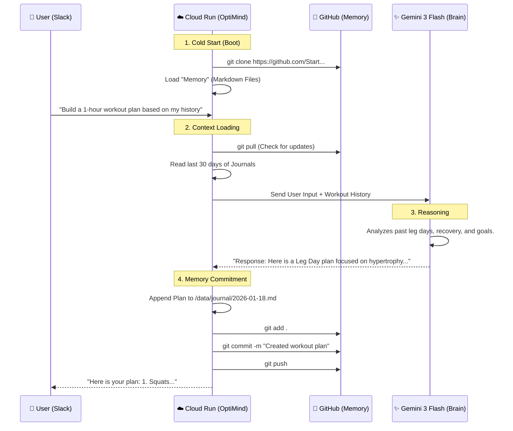

# OptiMind System Workflow (Cloud Architecture)

This document explains the lifecycle of a single interaction in the **OptiMind** system once migrated to the cloud.

## The "Hacker's Cycle"
The core philosophy is **"Git as Brain"**. The application state is not in a database; it is in the Git commit history.

## Component Roles

### 1. 📱 Slack (The Interface)
*   **Role**: The **User Interface**. It serves as both the input terminal and the display for the Agent's intelligence.
*   **Interaction**:
    *   **Input**: Sends your questions ("Plan my day") to Cloud Run.
    *   **Output**: Renders the Agent's rich markdown responses, workout plans, and daily schedules.

### 2. ☁️ Google Cloud Run (The Body)
*   **Role**: The "Executor". It is a serverless container that wakes up when Slack knocks.
*   **Key Feature**: It has **Amnesia**. Every time it starts, it is a blank slate.
*   **The Fix**: On startup, it uses your `GITHUB_PAT` to **Clone** your repository. This gives it "Instant Memory".

### 3. ✨ Gemini 3 Flash (The Brain)
*   **Role**: The "Processor". It takes the massive amount of text (Context) gathered by the Body and decides what to do.
*   **Interaction**: The Body sends: `[System Instructions] + [Last 30 Days of Journals] + [User Input]`. Gemini replies with the answer + any actions.

### 4. 🐙 GitHub (The Memory)
*   **Role**: The "Hippocampus" (Long-term storage).
*   **Interaction**:
    *   **Read**: When the bot wakes up, it reads the repo to know who you are.
    *   **Write**: When the bot learns something (e.g., you worked out), it **Commits and Pushes** that fact to the repo.
    *   **Benefit**: If Cloud Run crashes or restarts, nothing is lost. The memory is safely in GitHub.
